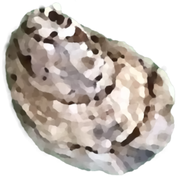
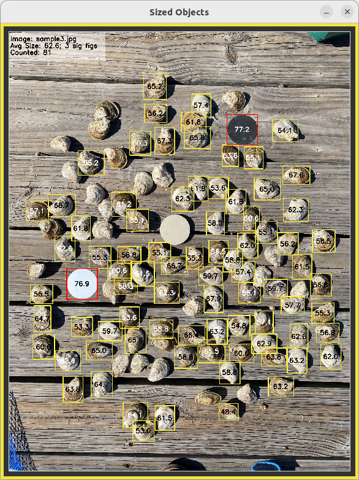
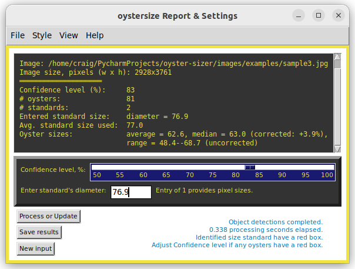

# Project: oyster-sizer

## Table of Contents
* [Overview](#Overview)
* [Requirements](#Requirements)
* [Usage](#Usage)
* [Screenshots](#Screenshots)
* [Sizing with lens distortion](#Sizing-with-lens-distortion)
* [Tips](#Tips)
* [Known Issues](#Known-Issues)
* [Attributions](#Attributions)
* [Size standards](#Example-size-standards)

### Overview:

The Python program oystersize.py analyzes triploid _Crassostrea virginica_ oyster images from various stages of aquaculture. Through a tkinter GUI, users can detect and classify oysters and a size standard, input the standard's size, and receive reports on oyster sizes, mean, median, and range along with a size-annotated image. Size standards need to be flat disk-like objects of known diameter. The program utilizes a YOLO11n object detection model, pretrained with COCO data, and trained with custom data for oyster and size standard images. Text and annotated image results can be saved to file.

The program can be executed from the command line on Linux, Windows, and macOS platforms.

### Requirements:
Python 3.9 - 3.12, with the Ultralytics package to run YOLO models. The packages OpenCV-Python, NumPy, and torch are used as imports, and are included with an `ultralytics` installation using `pip`. Tkinter (Tk/Tcl) is also needed, but is most likely already included in your Python distribution. To avoid problems with version dependencies, please consider setting up a new virtual environment as described below. 

Program development environments were Linux Ubuntu 22.04 (Python 3.10), Windows 11 (Python 3.11), macOS 13.2 (Python 3.9), and macOS 15.0 (Python 3.12.7). As of 8 November 2024, when installed as described here, the ultralytics package installation is not compatible with Python 3.13.

As with all repository downloads, it is best practice to install required packages into a Python virtual environment. This avoids undesired changes in your system's Python library and ensures having all compatible dependencies. To use `oystersize.py`, the recommended way to set up a clean environment, one which has all required packages and dependencies, is with these commands:

Create a venv directory in the current folder (use whatever directory name you like):

    `python3 -m venv oystersize_venv`

Activate this new virtual environment:

    `source oystersize_venv/bin/activate` (Linux and macOS)
    `oystersize_venv\Scripts\activate` (Windows)

Install the `ultralytics` package in the currently active virtual environment (need latest versions of `pip` and `ultralytics`):

    `python3 -m pip install --upgrade pip` 
    `python3 -m pip install ultralytics`

Installing the `ultralytics` package installs all needed program imports and NVIDIA tools to use a CUDA compatible GPU. If you don't have a CUDA GPU, the program will still run fine. If you already have the these packages installed in some other Python environment, do not assume it will have compatible versions for ultralytics. Building a virtual environment from scratch guarantees compatibility.

Now, whenever you want to use `oystersize.py`, just activate this virtual environment, change directory to your downloaded repository directory, and run it as described below in Usage.

Deactivate a virtual environment with the command `deactivate`, or just close the terminal window.

### Usage:

From within your downloaded repository folder, the recommended command line invocation is : `python3 -m oystersize` (or `py -m oystersize` on Windows). This will open a window for selecting an image file for analysis. Currently supported image file formats are JPEG and PNG.

To view basic information, author, version, license, etc.: `python3 -m oystersize --about`

To have the settings and size report print to the Terminal in addition to saving to file: `python3 -m oystersize --terminal` (or use `-t` to invoke the argument).

As with any repository download, running within a virtual environment is recommended.

Be aware that a very large image file may require a few seconds to analyze, depending on your system performance. Be patient. Final processing elapsed time is displayed in the report window. If a CUDA-enabled NVIDIA GPU is available on you system, then it will be used for faster processing.

Quit the program with Esc key, Ctrl-Q key, or the close window icon from the report window or File menubar. From the command line, use Ctrl-C.

Sample image files are provided in this distribution's `images/examples` directory. From the opening window, users can browse to there or to whichever directory contains their image for analysis. Text file results and annotated images are saved to that same directory.

Displayed image sizes are initially scaled based on screen size. Scaling can be changed later with the Ctrl-Left_arrow and Ctrl-Right_arrow keys (use Shift-Control on macOS) or from a menu pull-down.

Oysters or sizing disks extending beyond or within 3 pixels of the image edge are excluded from analysis.

If more than one standard is present, their average size is used for measurements. If differently sized standards are present, and their pixel sizes have a standard deviation over 10, then, once a standard value is entered, a warning message is displayed about possibly compromised results. The user can then decide to proceed or not.

The confidence level slider bar changes the model's object detection probability. In most situations it will not need to change from the 75% default setting. Take a close look at the sized image for things that don't look right. Read any information messages that pop up. Use your discretion to obtain accurate sample population metrics.

If a particular oyster is not detected at any confidence level, it may be because it was classified both as a disk AND an oyster. Such cases are excluded from analysis and annotation. If an oyster is boxed in red, it is a false positive detected as a size standard. Adjust the confidence level until it is excluded or identified as an oyster. Also check the annotated image for any oyster that has two or more overlapping boxes. Increasing the confidence level should remove extra boxes (false positive multiple detections).

Some non-oyster shells or similar objects may be detected as oysters. The model was trained to distinguish oysters from sizing disks, not from other shell-like objects.

### Screenshots:

Farmed oysters sampled from a population ready for market, using sample image `images/examples/sample3.jpg`. The size standards were a hockey puck (painted, center) and two plastic cut-outs. The "Sized Objects" window shows labeled bounding boxes of detected oysters and size standards (red boxed), with inset summary metrics (top left). The black and white plastic cut-out standards had a diameter of 76.9 mm, which was entered as the known diameter. The "oystersize Report & Settings" window shows the full report. The default Confidence level of 75% will detect 98 of 105 oysters, with an estimated average of 62.0 mm, but also gives a 'false positives detected' warning. Increasing the Confidence level to 83%, as shown, excluded false positive detection of the center not-well-contrasted standard, and so detected 81 oysters with an estimated average of 62.6 mm. By comparison, measuring all 105 oysters with a digital caliper provided an actual sample average of 62.9 mm. Not bad! 

You should expect that the program's size estimates are within 5% of actual sample sizes. This may vary depending on the quality of the image, the size standard used, and the number of oysters detected.

Sample size means and medians are estimated based on an auto-generated correction factor, which is displayed in the report window. Size annotations of individual oyster and their reported ranges are not corrected. See [Known Issues](#Known-Issues) for more information.

### Sizing with lens distortion:
There are three ways to deal with lens distortion to obtain the best size estimates. For example, an iPhone 11 using the wide-angle (normal) lens at a zoom of 1x, with the sample stage at a 20-inch distance and the size standard placed at the center, there is ~2% increase in the population mean size because objects farther from the center cover slightly more pixel area than their actual size. With the ultra-wide lens (e.g. zoom of 0.7x), the sizing error is about 3% to 4%. If the ultra-wide lens, any sizing errors could be minimized by using your camera's built-it lens correction option. iPhones 12 and later have a camera "Setting for Lens Correction", as does the Samsung Galaxy S series.

If several identical size standard disks are placed at various positions across the image, their pixel diameters will be averaged to obtain a more representative sizing factor to apply across all oysters. This is the most accurate method for sizing with lens distortion.

### Tips:
* For best results, use a high-resolution image with reasonably contrasted  background. Oysters and standards should not be piled up. Touching and slightly overlapping oysters are fine, but should not overlap any standard. The shot should be straight down, not at an angle. Training of the YOLO model for oyster detection was mainly with images in a 4 x 3 aspect ratio (4032 × 3024 pixels), so images with similar aspect and resolution should give best results.
* The most accurate sizing is when one size standard is placed near the center of the image and another somewhere in a corner quadrant. Standards should be close to the sizes of the oysters being measured.
* Size standards should have a pixel diameter at least 4% of the image width or height. Smaller standards may not be detected, even after adjusting the confidence level.
* The maximum number of detected objects is 400. If more are detected, the program will display a warning and only the first 400 will be analysed.
* Generally, more detected oysters lead to more accurate results, but it is not necessary to detect every single oyster to obtain usable population metrics. Camera distance, cropping, and standards placement can affect detection and size estimates, so experiment with these variables to find what works best for your setup.
* A summary of results is inset in the top left corner of the "Sized Objects" image. It will toggle off when changing annotation Styles, but can be toggled on with the Ctrl-I key (Command-I on macOS) or from the View pull-down menu.
* Very large or complex images may take more time to process, depending on system performance. Be patient. For best response, try to not have other programs running that use NVIDIA CUDA (optional) or have intensive CPU usage.

### Known Issues:
Sizing is based on the longest side of an object's bounding box. When more mature (oblong) oysters are oriented on the diagonal, assuming random orientation in the sample, 'longest side' size estimates will be underestimated for the sample population. To compensate, the program calculates a correction factor, based on mean ratio of box dimensions, to provide corrected mean and median estimates to within 4% of actual. A better solution is being sought, perhaps by using a rotated bounding box model.

For macOS, if an expected window does not appear, or the startup appears stalled, you may just need to click the Python Launcher icon in the Dock to make windows visible. This is a known issue with tkinter on macOS. See: https://www.python.org/download/mac/tcltk/

### Attributions
The yolov11_ultralytics object detection package is from:

Glenn Jocher and Jing Qiu, 2024, Ultralytics YOLO11,
https://github.com/ultralytics/ultralytics, orcid 0000-0001-5950-6979, 0000-0002-7603-6750, 0000-0003-3783-7069, license AGPL-3.0.

The `to_precision.py` utility module to manage significant digits was sourced from 
https://github.com/BebeSparkelSparkel/to-precision/releases/tag/0.0.0
It was edited to match this project's coding style.

All photo images are from the author, C.S. Echt.
Image and labels datasets used for training and validation were uploaded to HuggingFace https://huggingface.co/csecht/acquaculture_oysters/tree/main on 15 February 2025. Synthetic disk training images in that dataset were created with the Python repository at: https://github.com/csecht/synthesize-disks.

### Example size standards.
Enter the millimeter diameter value in the Size standard entry field. The standard's size is then used to convert pixels to millimeters for all objects in the image. Sizes are reported using appropriate significant figures, as limited by the entered standard's significant figures or the pixel size of the standard, whichever is less. 
The size standard is excluded from the reported oyster size metrics. Any solid disk of a known diameter, using whatever measuring units you like, can be used.
The closer the standard's diameter is to the oysters being sized, the more accurate the size metrics will be.

| Disk        | mm dia. | Notes                | s.f. |
|-------------|--------:|----------------------|------|
| Hockey puck |      76 | Standard 3 inch puck | 2    |
| Cent        |      19 |                      | 2    |
| Nickel      |    21.2 |                      | 3    |
| Dime        |    17.9 |                      | 3    |
| Quarter     |    24.3 |                      | 3    |
| Custom      |     unk | User enters diameter | tbd  |
